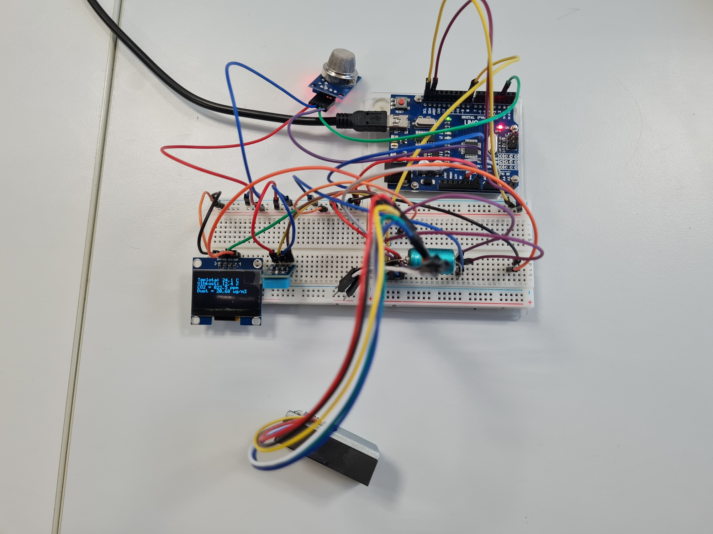
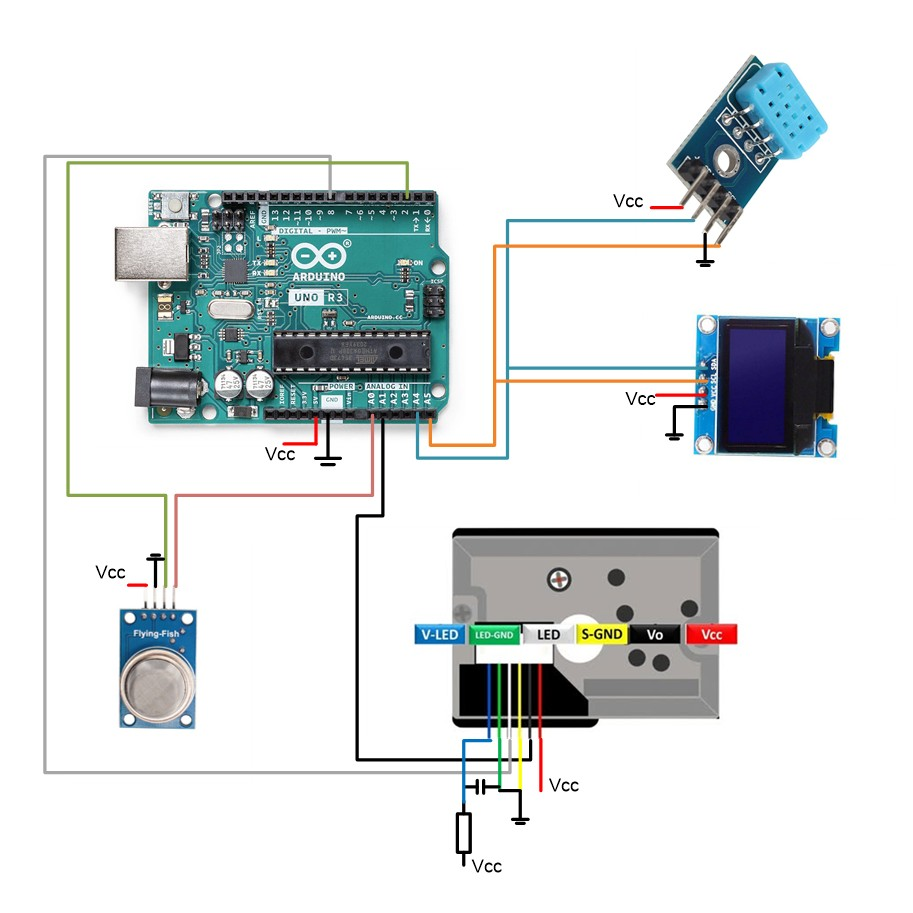
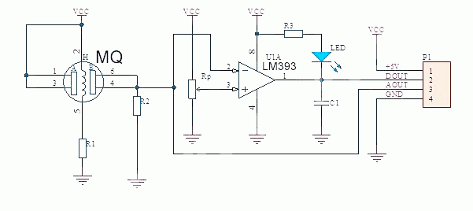
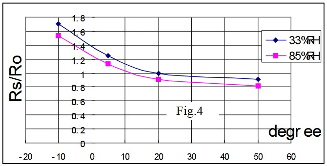
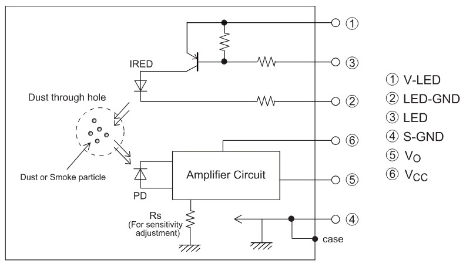
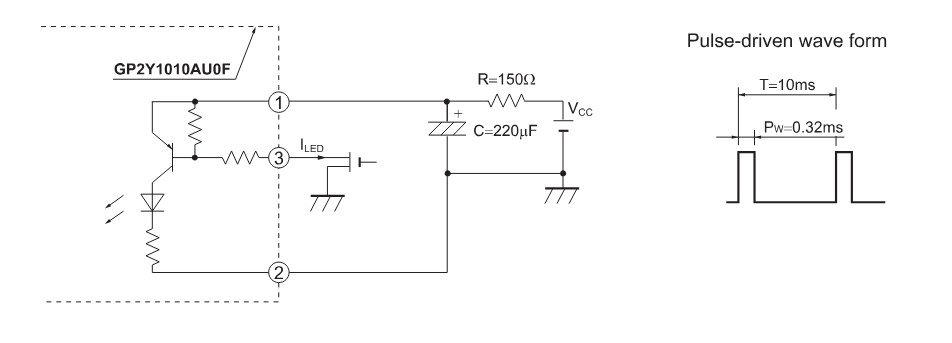
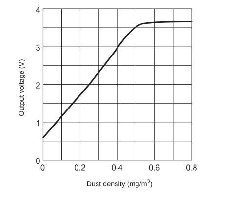

# Indoor air quality monitoring system  

Členové týmu

1. Jan Cícha (zodpovědný za měření teploty, vlhkosti a zobrazení na displeji)
2. Pavel Horský (zodpovědný za měření CO2 a prachových částic)

## Abstrakt  
V tomto projektu jsme se zabývali naprogramováním mikrokontroleru obsluhující několik periferií. Konkrétním cílem bylo měření kvality ovzduší jako je teplota, vlhkost, obsah COměřicí zařízení, které monitoruje vlastnosti vzduchu pomocí několika senzorů a prochových částic. Uživateli jsou následně data přehledně prezentována na displeji.

---
## Měřené parametry  

- Teplota  
- Relativní vlhkost  
- Množství CO2 
- Prachové částice PM  

## Hardwarové komponenty  

| Komponenta | Funkce | 
|------------|--------|
| **ATmega328 / Arduino Uno** | hlavní MCU |
| **DHT12** | měření teploty a vlhkosti |
| **MG135** | indikátor kvality vzduchu / CO₂ |
| **GP2Y10** | optický senzor prachu | 
| **OLED displej (I2C)** | zobrazení dat | 

---
## Kompletní zapojení mikrokontroleru s periferiemi

### Schéma zapojení

---
## Popis použitého hardwaru  
### Arduino UNO
Jedná se o mikrokontroler s procesorem ATmega328P pracující s 8bitovou architekturou na maximální frekvenci 16 MHz.

### DHT12  
Digitální senzor poskytující údaje o teplotě v rozmezí od 20 do 60 °C s přesností 0.5 % a vlhkosti v rozmezí od 20 do 95 % s přesností 5 %. Přesnost měření vlhkosti je ale závislá na vlhkosti samotné a na teplotě (přesnější data uvedena v datasheetu).

### MG135  
MQ-135 je plynový senzor určený k detekci různých škodlivých plynů, jako je amoniak, oxidy dusíku, benzen, kouř, alkohol, CO₂... Pracuje na principu změny odporu materiálu v závislosti na koncentraci plynů ve vzduchu, není tedy jednoduše určitelné, o jaký typ plynu se jedná. Modul umožňuje jak analogové měření aktuální koncentrace plynů na odporovém děliči, tak i digitální varování přes zabudovaný komparátor s nastavitelnou komparační úrovní. Jeho nevýhodou pro testování je nutnost předehřívání, podle výrobce 24 h. Na následujícím obrázku je možné vidět zapojení modulu pro MQ135.

Jak již bylo zmíněno, na digitálním pinu je možné snímat hodnotu na výstupu komparátoru, pro nízkou úroveň je koncentrace překročena a rozsvítí se i zabudovaná LED dioda.
Pro možnost přesnějšího snímání koncentrace plynů slouží analogový výstup, na kterém je snímáno napětí UL na zátěžném odporu RL a z něj dopočítáván snímací odpor RS.

Koncentrace plynů se určí jako poměr aktuálního odporu rezistoru Rs k referenční hodnotě získané po nahřátí modulu ve známé koncentraci plynů. Jako reference byl brán venkovní vzduch s průměrnou lpncentrací 400 ppm CO2. Na následujících grafech je možné vidět závislost na koncentraci plynů a na teplotě.

Pro výpočet byla použita knihovna od G.Krocker v jazyce c++, která byla upravena do jazyka c.

### GP2Y10  
GP2Y10 je prachový sensor s optickým snímáním. Na jedné straně vysílá infračervené záření a na druhé snímá jeho intenzitu na fotodiodě a následně ji zesílí pomocí operačního zesilovače. Zapojení je možné vidět na následujícím obrázku

Modul vyžaduje PWD modulovaný signál pro řízení LED o přesně daných parametrech. Délka pulzu 0,32 ms a délka periody 10 ms viz následující obrázek. Protože je dioda velice rychle spínána, pro vyhlazení napájení je přidán kapacitor s nabíjecím rezistorem. Z tohoto důvodu je LED řízena PNP tranzistorem, což znamená, že dioda sepne pro nízkou úroveň řídícího signálu, což je inverze ukázkového signálu z technické dokumentace.

Po sepnutí led je nutné chvíli počkat, a v čase 0,28 ms od sepnutí LED přečíst analogový signál zesílený operačním zesilovačem.

Závislost napětí na prašnosti byla aproximována pouze lineární část přímkou.

### OLED displej 
OLED display s bílým podsvícením o velikosti 128x64 bodů a úhlopříčce 1,3". Samotný displej je také doplněn o driver umožňující komunikaci s displejem pomocí I2C.

## Software

 
## Reference

https://www.laskakit.cz/user/related_files/mq135.pdf

https://robototehnika.ru/file/DHT12.pdf

https://github.com/GeorgK/MQ135/blob/master/README.md

https://github.com/Bobbo117/MQ135-Air-Quality-Sensor

https://ww1.microchip.com/downloads/en/DeviceDoc/Atmel-7810-Automotive-Microcontrollers-ATmega328P_Datasheet.pdf

https://images.prismic.io/circuito/8e3a980f0f964cc539b4cbbba2654bb660db6f52_arduino-uno-pinout-diagram.png?auto=compress,format

https://www.teachmemicro.com/wp-content/uploads/2020/01/MQ-135-schematic-diagram.png

https://global.sharp/products/device/lineup/data/pdf/datasheet/gp2y1010au_e.pdf

https://www.makerfabs.com/media/catalog/product/cache/5082619e83af502b1cf28572733576a0/m/q/mq135_gas_sensor_for_air_qaulity_2.jpg

https://store.arduino.cc/cdn/shop/files/A000066_03.front_1200x900.jpg?v=1727098250

https://www.aranacorp.com/wp-content/uploads/screen-oled-tf052-i2c.jpg

https://www.satisled.com/web/image/product.template/2227/image_1920?unique=fcce363

https://scontent.fprg5-1.fna.fbcdn.net/v/t39.30808-6/480134053_680938661130280_7536151328648901129_n.jpg?stp=dst-jpg_p180x540_tt6&_nc_cat=111&ccb=1-7&_nc_sid=127cfc&_nc_ohc=XAGdk8Cp8jwQ7kNvwGr0dlI&_nc_oc=Adnqn8zjSIOLKhr-gq0Zo5PLHWnjaZutM0EeQh6IEbLQRz_g0Lb48z_uEpWwmfyFkn4&_nc_zt=23&_nc_ht=scontent.fprg5-1.fna&_nc_gid=HV_TRP9YEL8zXWH6P62ZDw&oh=00_AfmrSXZrogUnV8316JQrpE-WaoDcZ2t6czYLzFse6-jXWQ&oe=693B1685